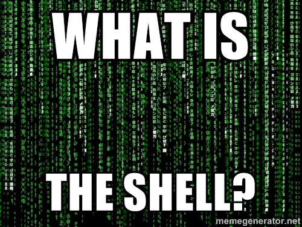
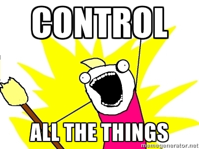

## Command Line Ninja -- Part 1, Introductions.

When you log into the terminal, you are placed into a "shell" 

### Slide: What is the shell?  (What is the matrix?)

with shell -- in particular, root-shell -- access to a computer you can do whatever you want.

Very powerful -- especially if you get network access (and so are connecting from home or a coffee shop).

### Slide: Control all the things

Access the very heart of your computer, your server, or somebody else's computer or server.

### Slide: What next?

* setting a crontab
  * opening a website (rickroll)
  * playing music (nujabes alarm)
* ssh-ing into a server (gathering on the server)
  * creating random websites
  * creating random webservices
* styling your shell
  * customizing colors

### Next Time

* Nano/Vim/Emacs the path is yours

