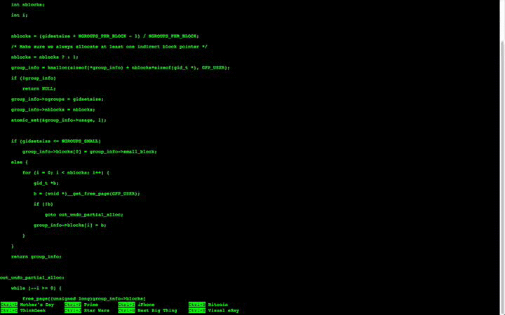

Command-Line-Ninja-Curriculum
=============================

Become a command line ninja.

## Curriculum

## Introduction

### github

**If not already everyone has a github account**

### day 1

* date
* say
* echo
* vim
* open/xdg-open any file
* crontab

### Project 1:
**make a music based alarm:**

* save on github

### Project 2:
**make a youtube based alarm**

* save on github

## Looking cool

* alias -- speed values
* tmux -- screen multiplexing and looking cool

### moving around

cntl-a
cntl-e
alt-(left/right)
cntl-u
cntl-k
cntl-l

### Round 1:

* mkdir
* rm
* shutdown
* ssh

* find

TODO:

have these bookmarked

General resources:
http://www.commandlinefu.com/commands/view/6130/use-screen-as-a-terminal-emulator-to-connect-to-serial-consoles

vimgolf

explainshell

* http://hackertyper.com/
